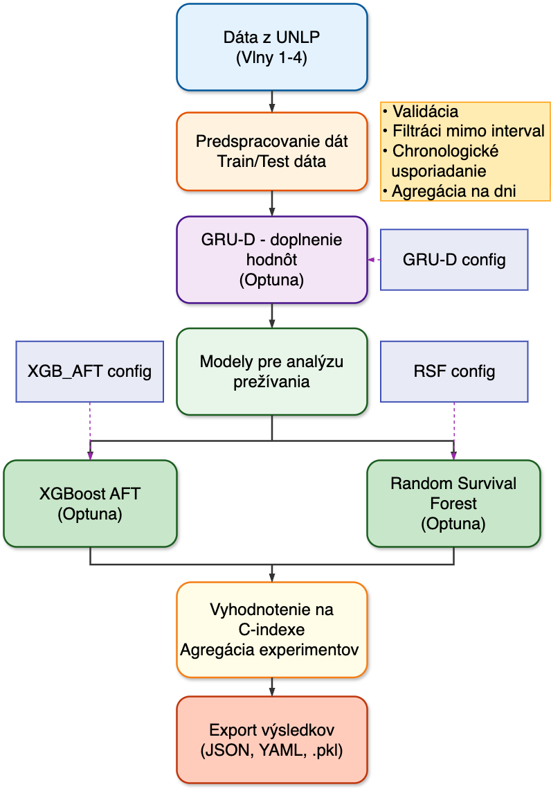

<h1 align="center">Aplikácia modelu prežitia na reálnu vzorku medicínskych dát</h1>
<h2 align="center">Diplomová práca</h3>

Tento dokument poskytuje podrobný prehľad o architektúre, komponentoch a funkcionalite pipeliny vyvinutej pre analýzu prežitia na medicínskych dátach. Dokumentácia pokrýva štruktúru zdrojového kódu, konfiguráciu, trénovanie modelov a ukladanie výsledkov.



## Štruktúra Projektu

Hlavný zdrojový kód sa nachádza v priečinku `src`. Kľúčová logika je obsiahnutá v submodule `pipeline`.

```text
src/
└── pipeline/
    ├── config/           # Konfiguračné triedy a načítavanie YAML
    ├── core/             # Hlavná logika experimentov
    │   ├── imputer/      # Moduly pre dopĺňanie dát (GRU-D)
    │   ├── survival/     # Moduly pre analýzu prežitia (Data, Models, Trainer)
    │   └── experiment.py # Orchestrátor celej pipeliny
    └── utilities/        # Podporné nástroje
        ├── calculations.py (vynechané z dokumentácie)
        ├── data_exploration.py
        ├── data_loader.py      # Načítanie dát a caching
        ├── data_preparation.py # Nízkoúrovňová logika predspracovania
        └── experiment_logger.py # Ukladanie výsledkov
yaml/                     # Konfiguračné súbory experimentov (XGBoost, RSF)
```

## Prerekvizity

Pre spustenie projektu je potrebné mať nainštalovaný Python a príslušné knižnice.

**Verzia Pythonu:** Python 3.10 alebo novší

### Inštalácia a Vytvorenie Prostredia

Nasledujúce kroky popisujú, ako naklonovať repozitár a pripraviť virtuálne prostredie.

#### Klonovanie repozitára

```bash
git clone https://github.com/kkuichi/mp369ze.git
```
 ### Prepnutie na ing vetvu

```bash
git checkout ing
```

### A) Použitie requirements.txt a manuálne vytvorenie virtuáleho prostredia

#### 1. Vytvorenie virtuálneho prostredia (venv)

**Windows:**

Otvorte príkazový riadok (cmd) alebo PowerShell a spustite:

```cmd
python -m venv venv
venv\Scripts\activate
```

**macOS a Linux:**

Otvorte terminál a spustite:

```bash
python3 -m venv venv
source venv/bin/activate
```

#### 2. Inštalácia závislostí

Po aktivácii virtuálneho prostredia nainštalujte požadované knižnice zo súboru `requirements.txt`:

```bash
pip install -r requirements.txt
```
### B) Použitie uv a pyproject.toml

#### 1. Inštalácia `uv`

**Windows:**
```bash
powershell -ExecutionPolicy ByPass -c "irm https://astral.sh/uv/install.ps1 | iex"
```

**macOS a Linux:**
```bash
curl -LsSf https://astral.sh/uv/install.sh | sh
```

#### 2. Inštalácia záavislosti
```bash
uv sync
```
---

## API Referencia a Detailný Popis Komponentov

Táto sekcia obsahuje kompletný zoznam tried, metód a funkcií v kľúčových moduloch pipeliny.

### 1. Core (`src/pipeline/core`)

Modul `Core` obsahuje hlavnú business logiku celej pipeliny.

#### Experiment Orchestrator (`src/pipeline/core/experiment.py`)

**Trieda `ExperimentRunner`**
Riadi celý tok experimentu od načítania dát po uloženie výsledkov.

*   `__init__(data, imputer_data_config, imputer_trainer_config, imputer_model_config, survival_config, logger)`: Inicializácia orchestrátora so všetkými závislosťami.
*   `_prepare_single_wave(original_df, prepared_df, wave_name)`: Aplikuje sadu predspracovaní na jednu vlnu (merge, parse, pivot).
*   `prepare_waves(original_df_dict, prepared_df_dict, wave_names)`: Spustí prípravu pre všetky vlny.
*   `split_waves(pivoted_by_wave_dict)`: Rozdelí pivotované dáta na train/test pre každú vlnu.
*   `impute_waves(splits)`: Spustí trénovanie Imputera a doplnenie chýbajúcich hodnôt (fit na train, transform na train aj test).
*   `train_survival_model(imputed_splits)`: Spustí trénovanie survival modelu (XGB/RSF) na doplnených dátach.
*   `_evaluate_single_wave(model, imputed_test_df)`: Vyhodnotí model na jednej vlne (počíta C-index).
*   `evaluate_waves(models_by_wave, imputed_splits)`: Vyhodnotí modely pre všetky vlny.
*   `run(run_id)`: Hlavná spúšťacia metóda, ktorá riadi celú sekvenciu a využíva caching (Level 1: Imputed, Level 2: Pivoted). Prijíma voliteľný identifikátor behu `run_id`.
*   `run_multiple(n_runs)`: Spustí experiment viackrát (`n_runs` opakovaní) a agreguje výsledky. Využíva caching imputovaných dát, aby sa predišlo opakovanej imputácii.

#### Survival Modul (`src/pipeline/core/survival`)

**Dáta (`src/pipeline/core/survival/data.py`)**
Trieda `Data` zapuzdruje operácie nad dátami.
*   `__init__(config, data_loader, data_preparation, data_exploration)`: Inicializácia s voliteľnou injekciou `DataExploration` pre logovanie meraní.
*   `_create_patient_id(df)`: Vytvorí alebo unifikuje ID pacienta.
*   `load_original_data_dict()`: Načíta raw dáta z Excelu.
*   `_add_wave(df, wave_name)`: Pridá stĺpec s číslom vlny.
*   `drop_original_cols(original_df)`: Odstráni nepotrebné stĺpce.
*   `rename_original_cols(original_df)`: Premenuje stĺpce podľa mapovania.
*   `convert_original_gender_to_numbers(original_df)`: Konverzia pohlavia na 0/1.
*   `convert_original_admission_and_discharge_to_datetime(...)`: Konverzia dátumov príjmu/prepustenia.
*   `calculate_duration(...)`: Výpočet dĺžky hospitalizácie a odfiltrovanie neplatných (<=0).
*   `_count_measurements_in_cells(df, columns)`: Pomocná metóda pre počítanie meraní v bunkách; deleguje na `DataExploration.count_measurements_per_test`.
*   `_log_test_changes(before, removed_values, preprocessing_step, wave)`: Logovanie odstránených meraní (legacy helper pre kroky vracajúce explicitné `removed_values` dict).
*   `_append_snapshot_rows(before_df, after_df, preprocessing_step, wave)`: Porovná dva DataFrame-y z `count_measurements_per_test` a zapíše riadky s rozdielmi do `test_log_df`.
*   `_snapshot_step(df, step_fn, step_name, test_cols, wave, **kwargs)`: Spustí krok predspracovania a automaticky zaznamená štatistiky pred/po do `test_log_df` pomocou `_append_snapshot_rows`.
*   `clear_original_tests(original_df)`: Odstráni neplatné formáty hodnôt meraní a loguje zmeny cez `_snapshot_step`.
*   `sort_original_test_measurements(original_df)`: Chronologické zoradenie meraní v bunkách.
*   `normalize_original_test_measurements(original_df)`: Normalizácia časových značiek na dni od prijatia.
*   `remove_tests_outside_interval(original_df)`: Odstránenie meraní mimo hospitalizácie a loguje zmeny cez `_snapshot_step`.
*   `remove_patients_without_tests(original_df)`: Odstránenie pacientov bez akýchkoľvek meraní.
*   `prepare_original_data(original_df, wave_name)`: Wrapper pre všetky kroky prípravy "orig" dát.
*   `load_prepared_data_dict()`: Načítanie "prepared" (statických) dát.
*   `align_prepared_to_original(...)`: Zarovnanie pacientov v statickom datasete podľa filtrovaného originálneho datasetu.
*   `rename_prepared_cols(prepared_df)`: Premenovanie stĺpcov v statických dátach.
*   `select_prepared_columns(prepared_df)`: Výber relevantných stĺpcov.
*   `convert_prepared_binary_to_bool(prepared_df)`: Konverzia binárnych atribútov.
*   `convert_prepared_target_to_binary(prepared_df)`: Konverzia targetu (Survival event) na 0/1.
<!-- *   `handle_wrong_sat(prepared_df...)`: Oprava chybných hodnôt saturácie (SatO2). -->
*   `prepare_prepared_data(original_df, prepared_df, wave_name)`: Wrapper pre kroky prípravy statických dát.
*   `merge_original_and_prepared(...)`: Inner join časových a statických dát.
*   `parse_merged(...)`: Parsovanie "zbalených" buniek do long-form formátu.
*   `pivot_parsed_with_static(...)`: Pivotovanie long-form dát do wide formátu a pripojenie statických atribútov.
*   `_assert_no_patient_leakage(...)`: Kontrola prieniku pacientov medzi train a test.
*   `split_pivoted_to_train_test(pivoted_df)`: Stratifikované rozdelenie dát (GroupShuffleSplit/KFold).
*   `split_xy(df)`: Oddelenie príznakov (X) od cieľových premenných (y - Event, Duration).

**Modely (`src/pipeline/core/survival/models.py`)**
*   **Trieda `XGBModel`**:
    *   `_make_dmatrix(x, y)`: Vytvorí XGBoost DMatrix (s podporou pre censored data).
    *   `fit(x_train, y_train, x_val, y_val)`: Trénovanie modelu.
    *   `predict_risk(x)`: Predikcia rizikového skóre.
    *   `score(x, y)`: Výpočet C-indexu.
    *   `suggest_params(trial, config)`: Návrh hyperparametrov pre Optunu.
*   **Trieda `RandomSurvivalForest`**:
    *   `fit(x_train, y_train, x_val, y_val)`: Trénovanie RSF (scikit-survival).
    *   `predict_risk(x)`: Predikcia rizika.
    *   `score(x, y)`: Výpočet C-indexu.
    *   `suggest_params(trial, config)`: Návrh hyperparametrov pre Optunu.

**Tréner (`src/pipeline/core/survival/trainer.py`)**
*   **Trieda `Trainer`**:
    *   `_get_model_class()`: Vráti triedu modelu podľa konfigurácie.
    *   `_assert_no_group_leakage(...)`: Kontrola data leakage.
    *   `_objective(trial, x, y, groups)`: Objektívna funkcia pre Optuna optimalizáciu (Cross-Validation).
    *   `train(imputed_pivot_train_df, study_name)`: Spustí optimalizáciu a následne pretrénuje finálny model na celých trénovacích dátach.

#### Imputer Modul (`src/pipeline/core/imputer`)

**Dataset (`src/pipeline/core/imputer/datasets.py`)**
*   **Trieda `LongitudinalDataset`**:
    *   Dedič od `torch.utils.data.Dataset`.
    *   `__getitem__(idx)`: Vracia tenzory `X` (hodnoty), `M` (maska), `D` (delta čas), `target_mask` a `X_true_norm`.

**Modely (`src/pipeline/core/imputer/models.py`)**
*   **Trieda `BaseImputer`**: Abstraktná trieda, metóda `prepare_input` pre konkatenáciu vstupov.
*   **Trieda `GRUDImputer`**: Implementácia GRU-D (Gated Recurrent Unit with Decay).
    *   `forward(x, m, d)`: Dopredný prechod neurónovou sieťou.

**Preprocessing (`src/pipeline/core/imputer/preprocessing.py`)**
*   **Trieda `DataPreprocessor`**:
    *   `fit_transform(df)`: Konvertuje pandas DataFrame na 3D numpy tenzory (N, T, F), normalizuje dáta (Z-score) a počíta masky a delta časy.
    *   `denormalize(X_norm)`: Vráti normalizované predikcie na pôvodnú škálu.
    *   `denormalize_positive(X_norm)`: Vráti normalizované predikcie na pôvodnú škálu a zabezpečí nezáporné hodnoty pomocou Softplus aktivácie (klinická validita).
    *   `transform(df)`: Transformuje nové dáta (test set) pomocou parametrov z `fit`.

**Tréner (`src/pipeline/core/imputer/trainer.py`)**
*   **Trieda `ImputerTrainer`**:
    *   `__init__(data_config, trainer_config, model_config, model, preprocessor)`: Inicializácia trénera s volitene injektovateľným modelom a preprocessorom.
    *   `_create_optimizer(model, lr, weight_decay)`: Inicializuje Adam optimizer s L2 regularizáciou.
    *   `train_epoch(loader, model, optimizer)`: Trénovacia slučka jednej epochy (s logovaním loss).
    *   `_prepare_data(df)`: Pripraví dáta a vytvorí dataset pre PyTorch (vrátane self-supervised corrupt masky).
    *   `_optuna_objective(trial, X_norm, M, D, corrupt_mask, dataset)`: Objektívna funkcia pre optimalizáciu siete (hľadanie lr, dropout, hidden_size).
    *   `fit(df_train, study_name)`: Celý proces trénovania imputera (HPO + Final Fit).
    *   `transform(df)`: Imputácia chýbajúcich hodnôt pomocou natrénovaného modelu.
    *   `_map_back(df_original, X_filled, patients)`: Mapovanie 3D tenzorov späť do pandas DataFrame formátu.

### 2. Config (`src/pipeline/config`)

Modul pre definíciu a validáciu konfigurácie pomocou Pydantic modelov.

**Načítanie (`src/pipeline/config/config_loader.py`)**
*   `_load_config(path)`: Načíta YAML súbor.
*   `load_survival_config(path)`: Načíta a validuje konfiguráciu pre survival experiment vracia `SurvivalConfig`.
*   `load_imputer_config(path)`: Načíta a validuje konfiguráciu pre imputer vracia `ImputerConfig`.

**Zdieľaná konfigurácia (`src/pipeline/config/shared_config.py`)**
*   **Trieda `BaseConfig`**: Základné atribúty (`device`, `seed`, `experiment_name`, `test_size`).

**Survival Konfigurácia (`src/pipeline/config/survival_config.py`)**
*   **Trieda `SurvivalTrainConfig`**: Parametre trénovania (počet splitov, Optuna trials, smer optimalizácie).
*   **Trieda `SurvivalModelConfig`**: Parametre modelov (napr. `num_boost_round`, `early_stopping_rounds`, rozsahy pre Optunu: `eta_min/max`, `max_depth_min/max` atď.).
*   **Trieda `SurvivalConfig`**: Zastrešujúca trieda (`base`, `train`, `model`).

**Imputer Konfigurácia (`src/pipeline/config/imputer_config.py`)**
*   **Trieda `ImputerDataConfig`**: Dátové parametre (`T_max` - max dĺžka sekvencie, `corrupt_rate` - miera poškodenia pre self-supervised learning).
*   **Trieda `ImputerTrainerConfig`**: Parametre trénovania siete (`epochs`, `batch_size`, `lr`, `features` list).
*   **Trieda `ImputerModelConfig`**: Architektúra siete (`hidden_size`, `n_layers`, `dropout`).
*   **Trieda `ImputerConfig`**: Zastrešujúca trieda.

### 3. Utilities (`src/pipeline/utilities`)

Podporné nástroje používané naprieč celou pipelinou.

**Príprava Dát (`src/pipeline/utilities/data_preparation.py`)**
Nízkoúrovňové funkcie pre čistenie a parsovanie.
*   **Trieda `DataPreparation`**:
    *   `_split_cell(cell)`: Rozdelenie obsahu bunky podľa oddeľovača.
    *   `_parse_cell_to_datetime_value(cell)`: Extrakcia dátumu a hodnoty z textu.
    *   `identify_invalid_test_values(...)`: Detekcia hodnôt, ktoré nezodpovedajú regex patternu.
    *   `clean_invalid_rows_in_cells(...)`: Odstránenie neplatných riadkov v bunkách.
    *   `sort_datetime_values(df)`: Zoradenie meraní v bunke podľa času.
    *   `normalize_test_datetimes_to_days(...)`: Prevod dátumov na dni (int).
    *   `remove_tests_outside_hospital_stay(...)`: Filtrovanie meraní mimo intervalu hospitalizácie.
    <!-- *   `prepare_SatO2(...)`: Špecifická logika pre opravu saturácie. -->
    *   `parse(...)`: Transformácia "zbalených" stĺpcov do long formátu.
    *   `pivot(...)`: Pivotovanie do wide formátu.
    *   `attach_static_attributes(...)`: Pripojenie statických dát k pivotovanej tabuľke.

**Načítanie Dát (`src/pipeline/utilities/data_loader.py`)**
*   **Trieda `DataLoader`**:
    *   `load_original_waves()`: Načíta raw Excel súbory.
    *   `load_prepared_waves()`: Načíta statické dáta.
*   **Trieda `PivotedCache`**:
    *   `load_cache(wave_name)` / `save_cache(...)`: Ukladanie pivotovaných dát do Parquet formátu.
*   **Trieda `ImputerCacheLoader`**:
    *   `load_cache(wave_name)` / `save_cache(...)`: Ukladanie imputovaných dát a splitov pomocou Pickle.

**Explorácia Dát (`src/pipeline/utilities/data_exploration.py`)**
Nástroje pre analýzu dát (používané primárne v notebookoch a pri logovaní krokov predspracovania).
*   **Trieda `DataExploration`**:
    *   `head_tail(df, n)`: Zobrazí začiatok a koniec DF.
    *   `show_nan(df)`: Zobrazí štatistiku chýbajúcich hodnôt.
    *   `select_biomarkers(df, comorbidity, ...)`: Vyberie biomarkery pre špecifickú komorbiditu.
    *   `audit_daily_measurements(...)`: Porovnáva raw merania vs. pivotované dáta (audit strát).
    *   `analyze_measurement_intensity(...)`: Analyzuje vzťah medzi frekvenciou meraní a úmrtnosťou.
    *   `count_measurements_per_test(df, test_cols)`: Spočíta počet meraní v každom testovom stĺpci a vráti súhrnný DataFrame (počty, počet pacientov s testom, priemer na pacienta). Určená na volanie pred a po krokoch predspracovania pre logovanie zmien v `test_log_df`.

**Logovanie Experimentov (`src/pipeline/utilities/experiment_logger.py`)**
*   **Trieda `ExperimentLogger`**:
    *   `__init__(config, base_output_dir)`: Vytvorí adresár s timestampom.
    *   `_create_experiment_dir()`: Interná metóda pre vytvorenie hlavného adresára experimentu.
    *   `save_config(config)`: Uloží konfiguráciu do YAML.
    *   `get_wave_dir(wave_name, run_id, model_name)`: Vytvorí a vráti podpriečinok pre vlnu. Ak je zadané `run_id`, vytvorí podadresár pre daný beh; ak je zadané `model_name`, zahrnie ho do názvu adresára.
    *   `save_results(results, wave_name, run_id)`: Uloží metriky do JSON. Automaticky extrahuje názov modelu z výsledkov pre štruktúru adresára.
    *   `save_model(model, wave_name, run_id, model_name)`: Uloží model do pickle (s podporou XGBModel aj RandomSurvivalForest).
    *   `save_vizualization(fig, wave_name, filename, run_id, model_name)`: Uloží vizualizáciu (matplotlib figure) do adresára vlny.
    *   `save_aggregated_results(aggregated_results)`: Uloží agregované výsledky z viacerých behov do JSON súboru v priečinku `final_aggregated_summary/`.

---

## Ukladanie Výsledkov

Výsledky sa ukladajú do priečinka `output/` v koreňovom adresári.
Každý beh vytvára hierarchickú štruktúru adresárov:

```text
output/
└── <TIMESTAMP>_<EXPERIMENT_NAME>/
    ├── config.yaml                          # Konfigurácia experimentu (reprodukovateľnosť)
    ├── <WAVE_NAME>_run_<ID>_model_<NAME>/   # Výsledky jedného behu pre konkrétnu vlnu a model
    │   ├── results.json                     # Metriky (C-index a iné)
    │   ├── model.pkl                        # Binárny model
    │   └── <plot>.png                       # Vizualizácie (ak sú vygenerované)
    └── final_aggregated_summary/
        └── results.json                     # Agregované výsledky naprieč všetkými behmi
```

Pre jednoduchý experiment bez `run_id` sa adresár vlny nazýva len `<WAVE_NAME>/`.

---

## Príklad Použitia

Nasledujúce príklady ukazujú, ako zostaviť a spustiť experiment pomocou pipeliny.
Predpokladá sa, že konfiguračné YAML súbory sa nachádzajú v priečinku `yaml/`.

### Jednorazový beh (`run`)

Spustí celú sekvenciu raz: predspracovanie → imputácia (GRU-D) → trénovanie survival modelu → vyhodnotenie.
Využíva dvojúrovňový caching (pivotované dáta a imputované dáta), takže opakované spustenia sú rýchlejšie.

```python
from src.pipeline.config.config_loader import load_survival_config, load_imputer_config
from src.pipeline.core.survival.data import Data
from src.pipeline.utilities.data_loader import DataLoader
from src.pipeline.utilities.data_preparation import DataPreparation
from src.pipeline.utilities.data_exploration import DataExploration
from src.pipeline.utilities.experiment_logger import ExperimentLogger
from src.pipeline.core.experiment import ExperimentRunner

# 1. Načítanie konfigurácie zo YAML súborov
#    K dispozícii sú: yaml/xgb_aft.yaml, yaml/xgb_cox.yaml, yaml/rsf.yaml
survival_cfg = load_survival_config("yaml/xgb_aft.yaml")
imputer_cfg  = load_imputer_config("yaml/xgb_aft.yaml")

# 2. Zostavenie závislostí
data_loader      = DataLoader(survival_cfg.base)
data_preparation = DataPreparation()
data_exploration = DataExploration()          # voliteľné – slúži na logovanie meraní

data = Data(
    config=survival_cfg,
    data_loader=data_loader,
    data_preparation=data_preparation,
    data_exploration=data_exploration,        # umožní logovanie zmien v test_log_df
)

logger = ExperimentLogger(config=survival_cfg.base)

# 3. Vytvorenie orchestrátora experimentu
runner = ExperimentRunner(
    data=data,
    imputer_data_config=imputer_cfg.data,
    imputer_trainer_config=imputer_cfg.train,
    imputer_model_config=imputer_cfg.model,
    survival_config=survival_cfg,
    logger=logger,
)

# 4. Spustenie jedného behu
results = runner.run()

# Výsledky sú uložené do output/<TIMESTAMP>_xgb_aft_all_10/<WAVE>/
# Príklad obsahu results["evaluation"]:
# {
#   "wave_1": {"test_c_index": 0.72},
#   "wave_4": {"test_c_index": 0.68}
# }
print(results["evaluation"])
```

### Opakované behy s agregáciou (`run_multiple`)

Experiment sa spustí `n_runs`-krát. Imputované dáta sú cachované po prvom behu, takže ďalšie behy preskočia imputáciu (GRU-D) a spustia iba trénovanie survival modelu. Agregované štatistiky (priemer, smerodajná odchýlka C-indexu) sa uložia do `final_aggregated_summary/results.json`.

```python
# (rovnaké kroky 1–3 ako vyššie)

# Spustenie 10 opakovaných behov
runner.run_multiple(n_runs=10)

# Výstupná štruktúra:
# output/<TIMESTAMP>_xgb_aft_all_10/
# ├── config.yaml
# ├── wave_1_run_1_model_xgb_aft/
# │   ├── results.json
# │   └── model.pkl
# ├── wave_1_run_2_model_xgb_aft/
# │   └── ...
# └── final_aggregated_summary/
#     └── results.json   ← mean/std/min/max C-index pre každú vlnu
```

Príklad obsahu `final_aggregated_summary/results.json`:

```json
{
  "wave_1": {
    "mean_train_c_index": 0.843,
    "mean_val_c_index":   0.714,
    "mean_test_c_index":  0.701,
    "std_test_c_index":   0.023,
    "min_test_c_index":   0.661,
    "max_test_c_index":   0.738,
    "train - test c_index gap (mean)": 0.142
  },
  "wave_4": {
    "mean_train_c_index": 0.821,
    "mean_val_c_index":   0.693,
    "mean_test_c_index":  0.678,
    "std_test_c_index":   0.031,
    "min_test_c_index":   0.629,
    "max_test_c_index":   0.721,
    "train - test c_index gap (mean)": 0.143
  }
}
```

### Výber modelu

Zmenou YAML konfiguračného súboru môžete prepínať medzi dostupnými survival modelmi bez akejkoľvek úpravy kódu:

| YAML súbor          | Model                             | Kľúčový parameter          |
|---------------------|-----------------------------------|----------------------------|
| `yaml/xgb_aft.yaml` | XGBoost – AFT (Accelerated Failure Time) | `model_name: xgb_aft` |
| `yaml/xgb_cox.yaml` | XGBoost – Cox PH                  | `model_name: xgb_cox`      |
| `yaml/rsf.yaml`     | Random Survival Forest            | `model_name: rsf`          |

```python
# Prepnutie na RSF – stačí zmeniť cestu k YAML
survival_cfg = load_survival_config("yaml/rsf.yaml")
imputer_cfg  = load_imputer_config("yaml/rsf.yaml")
# ... ostatné kroky zostávajú rovnaké
```

